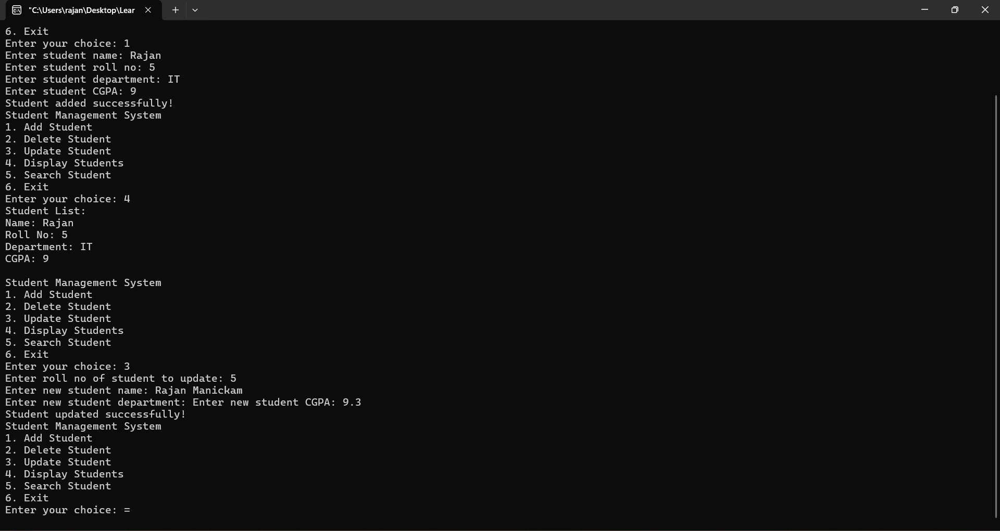

# Student Management System

A student management system built in C++. It's designed to efficiently handle student records, and grades.

## Features

* Add students
* Delete students
* Update student information
* Display all students
* Search for students by roll number

## Requirements

* C++ compiler (e.g. GCC)
* C++ standard library

## Usage

 Run the program and select an option from the menu:
	* 1: Add student
	* 2: Delete student
	* 3: Update student
	* 4: Display all students
	* 5: Search for student
	* 6: Exit

## Output

   

## License

This project is licensed under the MIT License. See LICENSE for details.
